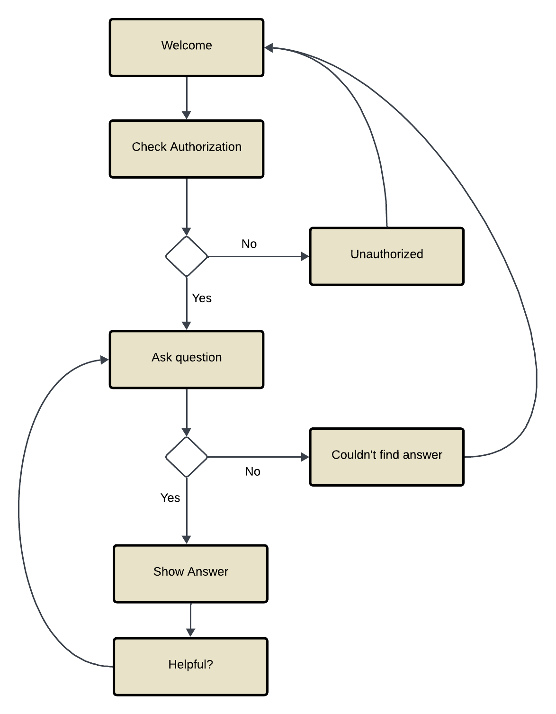

# Retrieval-Augmented Generation (RAG) for Buildings’ Technical Documents
My proposal is to use RAG to recover information from the hundreds of thousands of buildings’ technical documents generated during their construction process. Commercial buildings offer a large amount of data specifying their structure, equipment, operational details, control philosophy specifications and more. These documents often consist of a set of unstructured PDFs, stored within their private servers.

The sheer amount of documents makes it difficult to manually find critical information that might be useful to engineers, operational & maintenance staff or compliance audits. Moreover, the implementation of intelligent systems often relies on particular constraints regarding the buildings’ internal operation to be met, or for specific properties to be present, thus an automated tool for retrieving these details would severely improve the overall agility of such procedures, ergo lowering costs, as less time is required for gathering the correct documents and information.

Being technical documents, the vocabulary and semantics associated with the aforementioned data can be rather distinct, with a prevalence of terms and abbreviations that are exclusive to buildings and their respective equipment and contractors. Henceforth, the creation of embeddings might require special treatment to account for their distinctiveness compared to natural language. Furthermore, a hybrid search might be considered, given that the myriad of domain specific terms can potentially hinder an approach that relies solely on semantic searching.

## Important Files
* GML__Presentation.pd: Contains the presentation for the assignment.
* src/rag.py: the core implementation of the RAG
* src/db_wrapper.py contains all the database operations used to handle the embbeded data for the files.

Note: Locally, PostgreSQL was used, and it is the db vector solution for the metrics gathered.
Due to issues regarding the implementation, ChromaDB was used for the chat bot version.

## Data Analysis
The data used in this study is proprietary and contains sensitive information, some of which has been disclosed. The available files lack standardized conventions in terms of content, naming, hierarchy, or file type. 

From the total of 1918 files in the dataset, 609 PDF arquives were extracted, and their textual information was subsequently processed using the **PyPDF** library.

A pre-processing step was then performed, which involved splitting the text into manageable chunks, creating embeddings for these chunks, and storing them in a persistent database for future retrieval and analysis.

## Project Structure
The project operates as a service designed to provide users with information retrieval and document access via a chatbot.

The figure below illustrates the overall architecture of the project:

For the database solution, **CHROMADB** was chosen due to its efficiency in embedding textual information. The Retrieval-Augmented Generation (RAG) system was developed using **Gemini**, which was leveraged for both generating embeddings and constructing prompts. All components of the RAG system were implemented in Python.

To facilitate integration with the web framework, **Flask** was selected for its simplicity and lightweight nature.

User interactions are conducted through a **Telegram** chatbot, developed using **BLIP**, which serves as the front-end interface for the application. The flowchart below outlines the structure and organization of the chatbot:

## RAG
The following steps outline the organization of the Retrieval-Augmented Generation process:
* Data Pre-Processing: The database is processed and stored in a persistent storage system. Embeddings are generated for each data chunk, associating semantic representations with the corresponding content.

* Query Transformation: The user's input query is transformed into a sample answer by Gemini. This answer is subsequently used to create an embedding, which represents the semantic meaning of the transformed query.

* Syntactic Search: A syntactic search is performed to identify the top 100 relevant chunks. These selected chunks are then utilized as the context for answering the question.

* Prompt Composition: A structured template is populated with the query, context, formatting instructions, and the desired output format (in JSON). This complete prompt is sent to Gemini for response generation.

* Answer Validation: The generated answer undergoes validation through an additional API call to Gemini. This validation ensures that the response is based on the appropriate context, helping to mitigate instances of hallucinated answers where the model lacks sufficient context.

* Results Reporting: The final answer is presented to the user. If a relevant result is found, additional information, such as the document and page number where the answer was located, is provided to further substantiate the response.

This process combines retrieval-based techniques with generative models to improve the accuracy and relevance of the responses, with a built-in validation step to minimize errors and ensure quality results.

## Results
To evaluate the performance of the system, 100 questions and answers were generated from text chunks extracted from various documents within the dataset. Each of these questions was submitted to our RAG system, and the resulting answers were compared to the generated responses. The RAG system identified 93% of the answers as valid, meaning it was confident that the correct answer had been found.

To assess the similarity between the RAG-generated answer and the one derived from the context, we applied the SequenceMatcher algorithm from Python’s difflib library. This algorithm measures the similarity between two strings on a scale from 0 to 1. A threshold of 0.5 was set to determine a match, resulting in an accuracy rate of 58% for the RAG responses.

Additionally, an analysis of the document origins of the answers revealed that only 24% of the answers were sourced from the same document, which could indicate either an error or ambiguity in the source identification. This suggests that multiple documents may contain similar information, potentially contributing to inconsistencies in the retrieval process.

## Conclusions
The results suggest that Retrieval-Augmented Generation (RAG) is a promising approach for retrieving information from unstructured technical document collections. Empirical evaluations demonstrated that the system produced several accurate responses, and the automatically generated questions achieved a satisfactory level of accuracy.

However, despite these encouraging outcomes, we acknowledge the limitations of this automated testing approach. The reliance on text generation, even when provided with appropriate context, remains vulnerable to issues inherent in large language models (LLMs) that affect the RAG process itself.

Nevertheless, these tests offer valuable insights into the potential of the application, highlighting both its strengths and challenges. The system's validation component played a crucial role in mitigating issues related to hallucination, particularly when insufficient context was available. However, such cases continue to pose a significant challenge. This limitation may stem from the simplicity of the model, which was based on the free version of Gemini. The use of a more advanced model could potentially alleviate these challenges.

For future work, in addition to investigating alternative language models, incorporating non-textual elements from the dataset would be a valuable step. This integration could further enhance the system's performance and broaden its applicability.
